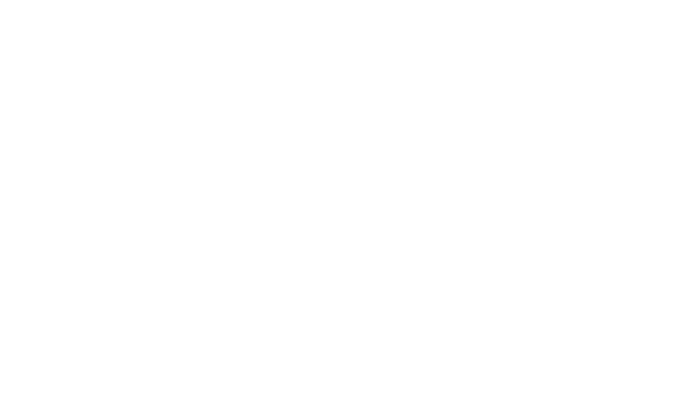

# Blackout

  

## Preamble

Welcome to Germany.  
A beautiful country with completely functioning internet that is one of the best on this planet...  

You just believed me didn't you? Hah good one. Let me tell you something.

We have **HORRIBLE** digital laws and digital infrastructure. We have TERRIBLE networking and absolutely overpriced data plans where neighboring countries are just laughing.

I have a data plan of 5 GB from my company. And this one does not bring me through the month. The WWW and generally everything internet related has been "fucked" so much where every site comes up with 2 GB of CSS and JS and you cant browse a single website without being afraid that you run out of data.

To stay sane i need music. And i literally can not access my music as soon as my mobile data is throttled. The throttling is so bad that sometimes even simple text messaging starts to become a challenge.

## The Solution

And here we have the solution when you sit in such a **Blackout**. You just download the music.

This program written in python is the over-complex solution to my problem.

It pulls Opus files through Youtube Music from tracks that you have liked and saves them in a directory of your choice. It also caches the already downloaded music in a database so that it wont just re-download everything.

From there you can use [Syncthing](https://syncthing.net/) or any other solution that grants you access to the files to pull it to your device for offline usage.

The program is extremely easy to use and even comes with an installer that installs a systemd service and a timer set to 5 minutes. It also copies the program to the `/opt` directory

## Installation

First clone this repository:

`git clone https://github.com/rathmerdominik/Blackout.git`

Switch to the project root:

`cd Blackout`

Then copy the `config.dist.toml` file to `config.toml`:

`cp config.dist.toml config.toml`

After that edit the values in there:

```toml
cookie_string = "" # view https://ytmusicapi.readthedocs.io/en/stable/setup.html
download_path = "" # where to download music to
file_name = "%(uploader)s_%(title)s.%(ext)s" # has to be Youtube DLP standard template https://github.com/yt-dlp/yt-dlp#output-template
db_path = "blackout.db" # where to write the database for caching
create_artist_dir = true 
create_album_dir = true
```

You also need to rename the `headers_auth.dist.json` file to `headers_auth.json`:

`mv headers_auth.dist.json headers_auth.json`

And at last just execute the installer as root. You can either use sudo or just run it as the root user:

`sudo bash installer.sh`

You can also edit the user and the group with which the systemd service will be run in the `installer.sh` file

The installer comes with an uninstaller if you want to remove **Blackout** from your system.

Run `sudo bash installer.sh uninstall` for that

## Contribution

I am fully aware that the script might not be optimal, yet.  
Every pull request can help carry this project further! So feel free to open one.


